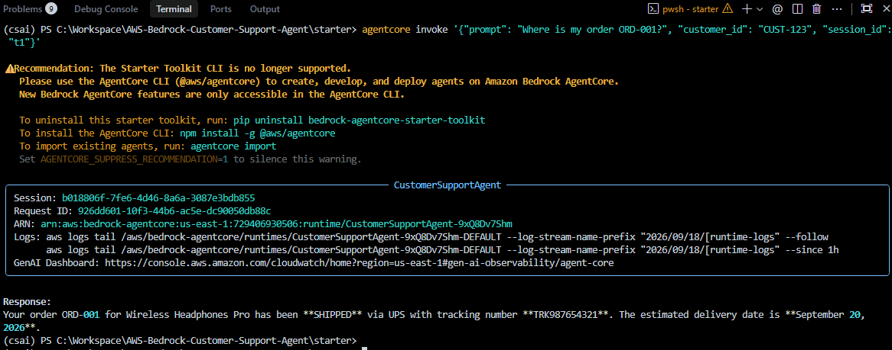
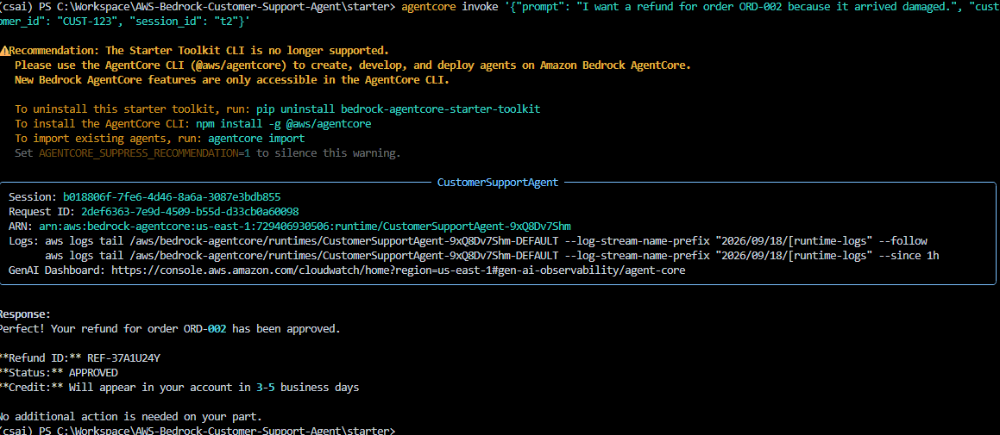
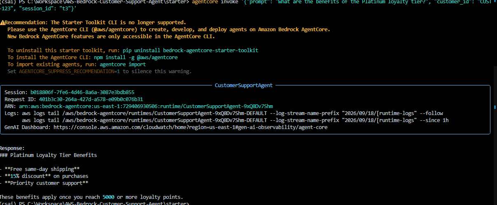
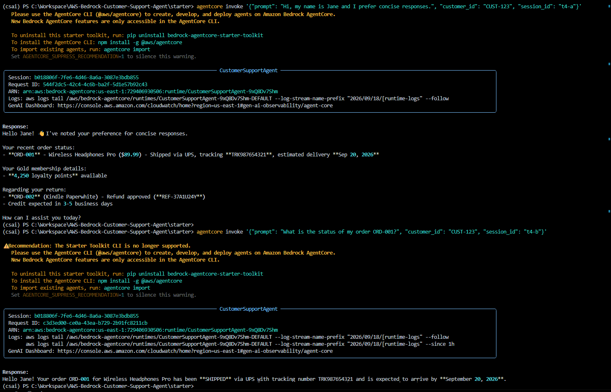
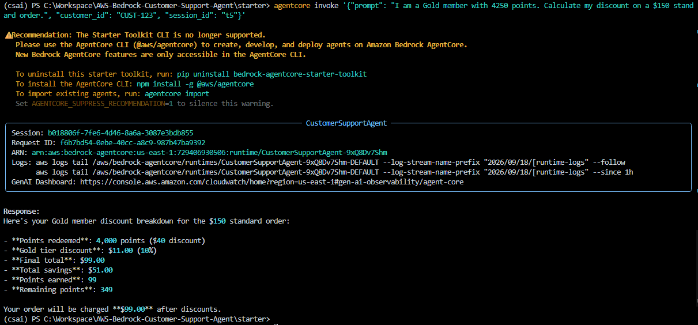
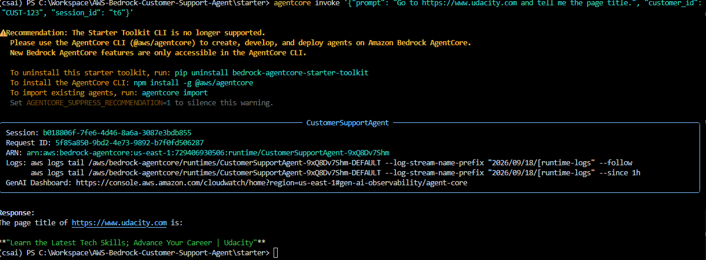
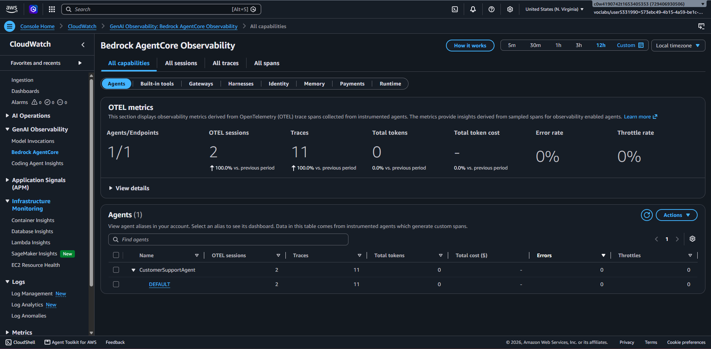

# Production-Grade Customer Support AI Agent — AWS Bedrock AgentCore

> **Udacity AWS Agent Engineer Nanodegree · Project 2 — Passed ✅**

A fully deployed, production-ready AI customer support agent built on **Amazon Bedrock AgentCore** using the **Strands Agents SDK**. The agent handles real customer requests — order tracking, refund processing, loyalty discount calculation, and live web browsing — while maintaining long-term memory of customer preferences and identities across sessions.

---

## System Architecture

```
Customer Request (JSON payload)
        │
        ▼
┌─────────────────────────────────────────────────┐
│           Amazon Bedrock AgentCore Runtime       │
│   (Containerised, auto-scaled, IAM-secured)     │
└─────────────┬───────────────────────────────────┘
              │
        ┌─────▼──────┐
        │  invoke()  │  ← @app.entrypoint
        │  (async)   │
        └─────┬──────┘
              │
       ┌──────▼──────────────────────────────────┐
       │        Strands Agent (Nova Lite)         │
       │  system_prompt + tools + memory hooks   │
       └──┬──────┬───────┬─────────┬─────────────┘
          │      │       │         │
    ┌─────▼─┐ ┌──▼───┐ ┌─▼──────┐ ┌▼─────────────────────┐
    │  KB   │ │ Code │ │Browser │ │ MCP Gateway           │
    │Search │ │ Interp│ │ Tool  │ │ (order-tracker +      │
    │  RAG  │ │Sandbox│ │ Live  │ │  refund-processor     │
    └───────┘ └──────┘ └───────┘ │  Lambda functions)    │
                                  └──────────────────────┘
              │
    ┌─────────▼──────────────────┐
    │  Bedrock AgentCore Memory  │
    │  (semantic facts +         │
    │   user preferences)        │
    └────────────────────────────┘
```

---

## Tech Stack

| Layer | Service / Library |
| :--- | :--- |
| **Agent Runtime** | Amazon Bedrock AgentCore |
| **LLM** | Amazon Nova Lite (via Strands `BedrockModel`) |
| **Orchestration** | Strands Agents SDK (`Agent`, `@tool`, `HookProvider`) |
| **Long-Term Memory** | Bedrock AgentCore Memory (semantic + preference strategies) |
| **Knowledge Base** | Amazon Bedrock Knowledge Base + S3 + OpenSearch Serverless |
| **Sandboxed Compute** | Bedrock AgentCore Code Interpreter |
| **Live Web Browsing** | Bedrock AgentCore Browser (`AgentCoreBrowser`) |
| **Tool Gateway** | Bedrock AgentCore Gateway (MCP over HTTP, `MCPClient`) |
| **Backend Lambdas** | AWS Lambda (Python) — `order-tracker`, `refund-processor` |
| **Observability** | Amazon CloudWatch — OTEL traces, metric filters, alarms |
| **IAM** | Scoped roles for `bedrock:Retrieve`, `bedrock-agentcore:*`, Lambda invocation |

---

## Key Engineering Decisions

### 1. `MemoryHook` — Lifecycle-Aware Long-Term Memory

Rather than hardcoding memory lookups inside each tool, memory was integrated using the Strands `HookProvider` pattern. Two lifecycle callbacks are registered on the agent:

- **`retrieve_customer_context`** fires on `MessageAddedEvent` — queries both the `semantic_extraction` and `user_preference` namespaces in Bedrock AgentCore Memory and prepends the results to the user's message as a `Customer Context:` block. The model always has relevant facts before it plans any action.
- **`save_support_interaction`** fires on `AfterInvocationEvent` — extracts the final plain-text `(user, assistant)` turn and persists it via `memory_client.create_event()`, stripping away any injected context so only clean signal is stored.

This hook-based approach keeps the memory logic cleanly separated from the agent's tool logic and allows it to scale independently.

### 2. `SafeGatewayToolWrapper` — Fault-Tolerant Gateway Integration

The MCP Gateway connects to external Lambda-backed tools (`get_order_status`, `process_refund`) over HTTP. These are subject to network failures, cold-start timeouts, and execution errors. To prevent the agent from crashing silently or returning raw stack traces to customers:

- Each tool loaded from the Gateway is wrapped in a `SafeGatewayToolWrapper` that inherits from `AgentTool` and overrides `stream()`.
- The wrapper catches `asyncio.TimeoutError`, `ConnectionError`, and generic exceptions at the tool-execution layer and replaces them with safe, actionable user-facing messages.
- Tool-loading itself uses `asyncio.wait_for(mcp_client.load_tools(), timeout=10.0)` with three distinct exception branches to handle connection, timeout, and misconfiguration cases cleanly.

### 3. Code Interpreter for Verified Arithmetic

Loyalty discount calculations run inside the **Bedrock AgentCore Code Interpreter sandbox** — an isolated Python runtime. This guarantees that floating-point arithmetic (points redemption, tier discounts, final totals) is deterministic and auditable rather than delegated to the LLM's probabilistic next-token prediction. A local Python fallback mirrors the same result contract (`points_redeemed`, `tier_discount_pct`, `final_total`, `remaining_points`) for when the sandbox is unavailable.

### 4. Playwright Browser Fix for AWS Lambda

Zipping on Windows strips execute permissions (`+x`) from Playwright's Linux Node.js binary (`/var/task/playwright/driver/node`). Since `/var/task` is mounted read-only in the Lambda runtime, the agent crashes at startup. The fix programmatically copies the binary to `/tmp`, sets `chmod 0o777`, and sets `PLAYWRIGHT_NODEJS_PATH` to the writable path — applied at module load time on non-Windows platforms.

---

## Capabilities Demonstrated

| Capability | Implementation | Test Command |
| :--- | :--- | :--- |
| **Order Tracking** | Lambda `order-tracker` via MCP Gateway | `"Where is my order ORD-001?"` |
| **Refund Processing** | Lambda `refund-processor` via MCP Gateway | `"I want a refund for ORD-002"` |
| **Knowledge Base RAG** | Bedrock KB Retrieve API over S3 product catalog | `"What are Platinum tier benefits?"` |
| **Long-Term Memory** | Cross-session recall via Bedrock AgentCore Memory | Two separate `session_id` invocations, same `customer_id` |
| **Loyalty Discount Calc** | Code Interpreter sandbox with arithmetic fallback | `"Calculate discount for Gold, 4250 pts, $150 order"` |
| **Live Web Browsing** | AgentCoreBrowser (Playwright) | `"Go to udacity.com and tell me the page title"` |
| **Observability** | CloudWatch OTEL traces + metric filter alarm | AWS Console — CloudWatch → Bedrock AgentCore |

---

## Live Demo Screenshots

### Test 1 — Real-Time Order Tracking
The agent calls the `order-tracker` Lambda via the MCP Gateway and returns shipping status, tracking number, and estimated delivery date.



---

### Test 2 — Automated Refund Processing
The agent processes a refund by calling the `refund-processor` Lambda, returning a reference ID and approval status within seconds.



---

### Test 3 — RAG-Powered Knowledge Base
The agent retrieves Platinum loyalty tier details from an S3-backed Bedrock Knowledge Base using semantic vector search (Amazon Titan Embeddings v2 + OpenSearch Serverless).



---

### Test 4 — Cross-Session Long-Term Memory
Session A introduces the customer as "Jane" with a concise communication preference. Session B uses a completely new `session_id` and recalls Jane by name, delivering a concise response — demonstrating persistent identity and preference memory across independent sessions.



---

### Test 5 — Sandboxed Loyalty Discount Calculation
The agent executes a Python discount calculation inside the AgentCore Code Interpreter sandbox. 4,000 points redeemed ($40 off), 10% Gold tier discount applied, final total $99.00 on a $150 order.



---

### Test 6 — Live Web Browsing
The agent uses a Playwright-backed remote browser session to navigate to udacity.com and return the live page title.



---

### Observability — CloudWatch GenAI Dashboard
OTEL trace spans collected from the deployed agent, showing 2 sessions, 11 traces, 0% error rate, and 0% throttle rate across the `CustomerSupportAgent` runtime.



---

## Project Structure

```
starter/
├── main.py                       # Complete agent implementation
│   ├── Configuration & Init      # BedrockModel, MemoryClient, boto3
│   ├── get_namespaces()          # Memory strategy namespace resolver
│   ├── MemoryHook                # Strands HookProvider (retrieve + save)
│   ├── search_knowledge_base     # @tool — Bedrock KB Retrieve API
│   ├── calculate_loyalty_discount# @tool — Code Interpreter sandbox
│   ├── SafeGatewayToolWrapper    # Fault-tolerant MCP tool wrapper
│   └── invoke()                  # @app.entrypoint — agent orchestration
├── lambda/
│   ├── order_tracker.py          # Lambda: order status lookup
│   └── refund_processor.py       # Lambda: refund approval workflow
└── product_catalog.txt           # Knowledge base source data (uploaded to S3)
```

---

## Deployment

```bash
# Install dependencies
pip install uv
uv sync

# Configure AgentCore (first time only)
agentcore configure

# Deploy to AWS
agentcore deploy

# Invoke the deployed agent
agentcore invoke '{"prompt": "Where is my order ORD-001?", "customer_id": "CUST-123", "session_id": "s1"}'
```

---

## Production Extensions

To take this agent to enterprise scale:

- **Auth:** Replace Gateway `NONE` auth with Amazon Cognito JWT + RBAC.
- **Data:** Swap Lambda in-memory mocks with DynamoDB global tables (encryption at rest).
- **Caching:** Add ElastiCache (Redis) in front of Knowledge Base retrieval for frequent queries.
- **Resilience:** Circuit breakers on external HTTP calls, SNS-to-PagerDuty on CloudWatch alarms.
- **CI/CD:** GitHub Actions — lint → test → `agentcore deploy` on merge to `main`.
